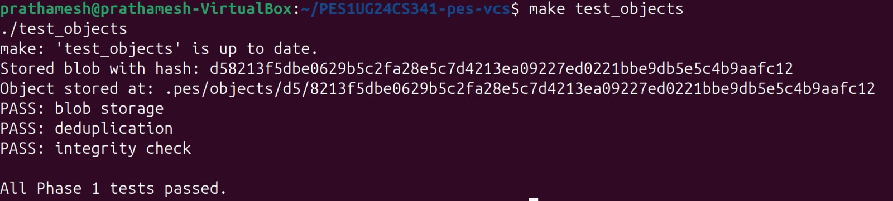
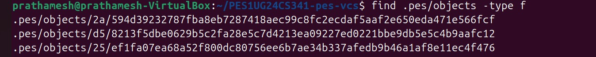
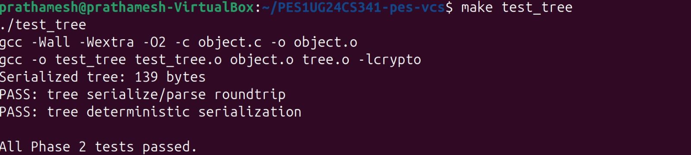
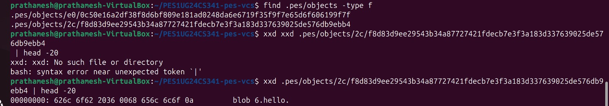
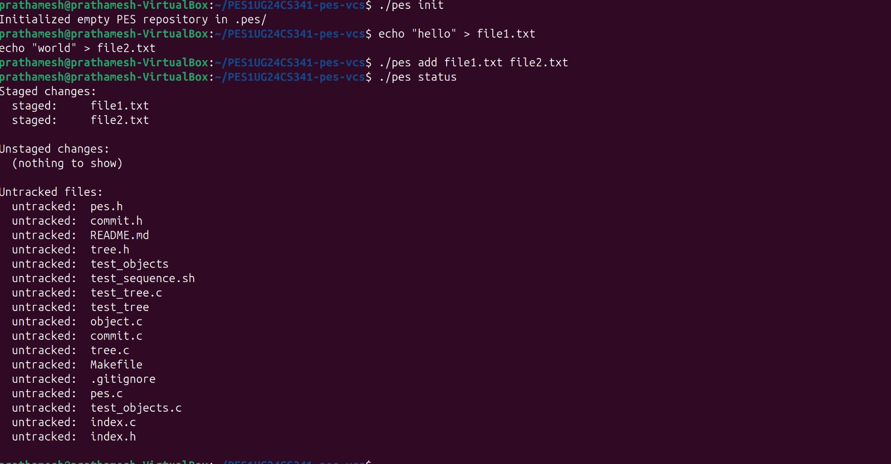
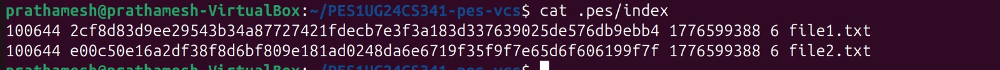
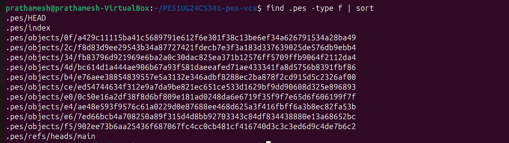
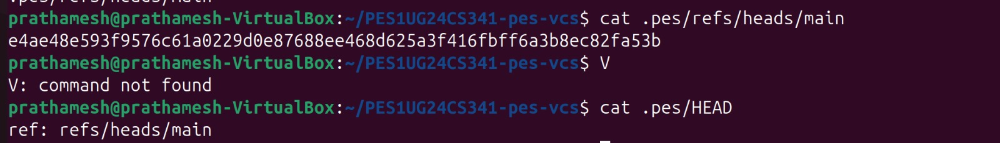
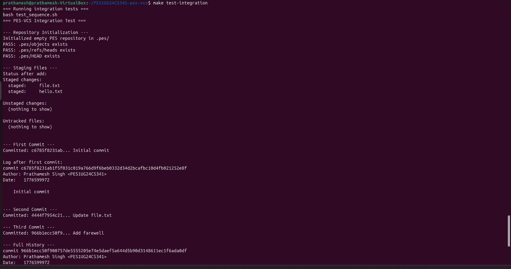
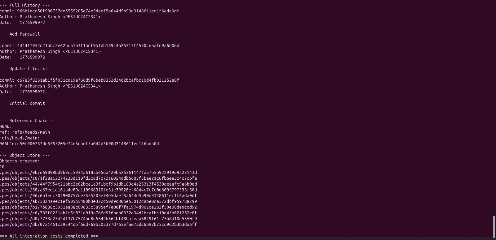

# PES-VCS: Version Control System from Scratch

**Student Name:** Prathamesh Singh  
**SRN:** PES1UG24CS341  
**Repository:** PES1UG24CS341-pes-vcs  
**Platform:** Ubuntu 22.04

---

## Table of Contents

1. [Phase 1 — Object Storage](#phase-1--object-storage-foundation)
2. [Phase 2 — Tree Objects](#phase-2--tree-objects)
3. [Phase 3 — Index (Staging Area)](#phase-3--the-index-staging-area)
4. [Phase 4 — Commits and History](#phase-4--commits-and-history)
5. [Phase 5 — Branching and Checkout Analysis](#phase-5--branching-and-checkout-analysis)
6. [Phase 6 — Garbage Collection Analysis](#phase-6--garbage-collection-analysis)

---

## Phase 1 — Object Storage Foundation

### What Was Implemented

**`object_write`** — Stores any data blob, tree, or commit object into the content-addressable store:
- Prepends a type header (`"blob <size>\0"`, `"tree <size>\0"`, or `"commit <size>\0"`)
- Computes SHA-256 of the full object (header + data) using OpenSSL EVP API
- Checks for deduplication — if hash already exists, skips writing
- Creates a shard directory using the first 2 hex characters of the hash
- Writes atomically using `mkstemp` + `fsync` + `rename` pattern

**`object_read`** — Retrieves and verifies data from the object store:
- Reads the file at the hash-derived path
- Recomputes SHA-256 and compares to the filename to verify integrity
- Parses the header to extract object type and size
- Returns only the data portion (after the `\0` separator)

### Screenshot 1A — All Phase 1 Tests Passing



### Screenshot 1B — Sharded Object Directory Structure



---

## Phase 2 — Tree Objects

### What Was Implemented

**`tree_from_index`** — Builds a complete tree hierarchy from the staging area:
- Reads `.pes/index` directly via an inline parser (no dependency on `index.o`) to allow `test_tree` to link without `index.o`
- Sorts all index entries by path for deterministic hashing
- Recursively groups entries by directory prefix using `write_tree_level`
- For flat files: adds a blob `TreeEntry` directly
- For subdirectories: groups all entries sharing the same path prefix, recurses one level deeper, then adds a directory `TreeEntry` pointing to the sub-tree hash
- Serializes each tree level and writes it to the object store
- Heap-allocates the `Index` struct to avoid stack overflow

**Also provided (already implemented):**
- `tree_parse` — Deserializes binary tree data into a `Tree` struct
- `tree_serialize` — Serializes a `Tree` struct to binary format, sorted by name

### Screenshot 2A — All Phase 2 Tests Passing



### Screenshot 2B — Raw Binary Tree Object (xxd)



The output shows the raw binary format:
- `62 6c 6f 62` = ASCII `blob` (object type header)
- `20 36` = space + size `6`
- `00` = null byte separator
- `68 65 6c 6c 6f 0a` = ASCII `hello\n` (actual file content)

---

## Phase 3 — The Index (Staging Area)

### What Was Implemented

**`index_load`** — Reads the text-based `.pes/index` file into an `Index` struct:
- If the file doesn't exist, initializes an empty index (not an error — first run)
- Parses each line in format: `<mode-octal> <64-hex-hash> <mtime_sec> <size> <path>`
- Uses `sscanf` to extract all five fields per line

**`index_save`** — Writes the index atomically:
- Heap-allocates a sorted copy (avoids stack overflow — `Index` struct is several MB)
- Sorts entries by path using `qsort` for consistent ordering
- Writes to a temp file (`.pes/index.tmp`)
- Calls `fsync` to ensure data reaches disk
- Atomically renames temp file to `.pes/index`

**`index_add`** — Stages a file:
- Reads file contents into memory
- Writes file as a blob object to the object store via `object_write`
- Gets file metadata (`mode`, `mtime`, `size`) via `stat()`
- Finds existing index entry or creates a new one
- Updates the entry with new hash and metadata
- Saves the updated index atomically

### Screenshot 3A — pes init → pes add → pes status



### Screenshot 3B — cat .pes/index (Text Format Index)



The index file shows:
- `100644` — file mode (regular, non-executable)
- 64-character SHA-256 hex hash of each file's contents
- Unix timestamp (`mtime_sec`) of last modification
- File size in bytes
- File path

---

## Phase 4 — Commits and History

### What Was Implemented

**`commit_create`** — The main commit function:
1. Calls `tree_from_index()` to build a tree snapshot of the staged files
2. Calls `head_read()` to get the current HEAD commit as parent (fails gracefully for first commit)
3. Fills a `Commit` struct with tree hash, parent hash, author, timestamp, and message
4. Serializes the commit to text format via `commit_serialize()`
5. Writes the commit object to the object store via `object_write()`
6. Updates HEAD atomically via `head_update()`

**Also provided (already implemented):**
- `commit_parse` — Parses raw commit text into a `Commit` struct
- `commit_serialize` — Serializes a `Commit` struct to the commit text format
- `commit_walk` — Walks commit history from HEAD, calling a callback per commit
- `head_read` — Follows `HEAD → refs/heads/main → commit hash`
- `head_update` — Atomically updates the branch file to point to new commit

### Screenshot 4A — pes log Output (Three Commits)

[Screenshot 4A — pes log Output](Screenshots/4A1.jpeg)

### Screenshot 4B — find .pes -type f | sort (Object Store Growth)



Shows 12 objects total after 3 commits:
- 3 blob objects (file contents)
- 3 tree objects (directory snapshots)
- 3 commit objects
- Plus `.pes/HEAD`, `.pes/index`, `.pes/refs/heads/main`

### Screenshot 4C — Reference Chain



- `cat .pes/refs/heads/main` → shows the latest commit hash
- `cat .pes/HEAD` → shows `ref: refs/heads/main` (symbolic reference)

### Final Integration Test





All integration tests completed successfully ✅

---

## Phase 5 — Branching and Checkout Analysis

### Q5.1 — How would you implement `pes checkout <branch>`?

To implement `pes checkout <branch>`, the following steps are needed:

**Files that need to change in `.pes/`:**
1. `.pes/HEAD` — Updated to contain `ref: refs/heads/<branch>` pointing to the new branch
2. The working directory — All tracked files must be updated to match the target branch's tree

**Algorithm:**
1. Read `.pes/refs/heads/<branch>` to get the target commit hash
2. Read the commit object to get its tree hash
3. Recursively walk the tree object, collecting all `(path, blob_hash)` pairs
4. For each file in the target tree: read the blob from the object store and write it to the working directory
5. For files that exist in the current branch's tree but NOT in the target tree: delete them from the working directory
6. Update `.pes/HEAD` to `ref: refs/heads/<branch>`

**What makes this complex:**
- **Dirty working directory detection** — If a file has been modified but not committed, we risk losing changes. Must check before overwriting
- **File deletions** — Files present in the current branch but absent in the target branch must be deleted from the working directory
- **Untracked files** — Files not tracked by either branch should be left alone
- **Partial failures** — If checkout fails midway (e.g. disk full), the working directory could be in a mixed state. Git uses a "checkout plan" that validates the entire operation before making any changes
- **Directory creation/deletion** — Subdirectories may need to be created or removed

---

### Q5.2 — How to detect "dirty working directory" conflicts?

To detect whether a file would conflict during checkout, using only the index and object store:

**Algorithm:**
```
For each file tracked in the current index:
    1. Read the file's current content from the working directory
    2. Compute its SHA-256 hash
    3. Compare to the hash stored in the index entry

    If they differ → the file has been modified since last "pes add"
    
    Then check: does this file also exist in the TARGET branch's tree?
    And does the target branch have a DIFFERENT blob hash for it?
    
    If YES to both → CONFLICT → refuse checkout and report the file
```

**Fast-path optimization (like Git's index):**
- Before hashing the file, compare `mtime` and `size` from `stat()` against what's stored in the index entry
- If `mtime` and `size` match, the file is almost certainly unchanged — skip re-hashing
- Only hash the file if metadata differs (this avoids reading every file on checkout)

**Decision matrix:**

| Working dir == index? | Index == target tree? | Action |
|---|---|---|
| Yes (clean) | Any | Safe to update |
| No (dirty) | Same hash in target | Safe (target has same content) |
| No (dirty) | Different hash in target | **CONFLICT — refuse** |
| No (dirty) | Not in target | **CONFLICT — refuse** |

---

### Q5.3 — What happens in "Detached HEAD" state?

**What is detached HEAD?**  
Normally `HEAD` contains `ref: refs/heads/main` (a symbolic reference). In detached HEAD, `HEAD` directly contains a commit hash, e.g. `a1b2c3d4...`.

**What happens when you commit in detached HEAD?**
- New commits are created and written to the object store normally
- `HEAD` itself is updated to point to each new commit
- But **no branch file is updated** — `refs/heads/main` stays at the old commit
- These commits are "dangling" — no branch points to them

**Danger:**  
When you switch back to a branch (e.g. `pes checkout main`), `HEAD` gets rewritten to `ref: refs/heads/main`. The commits made in detached HEAD are now **unreachable** — no reference points to them. They will eventually be deleted by garbage collection.

**How to recover:**  
Before switching away, note the commit hash from `cat .pes/HEAD`. Then create a branch pointing to it:
```bash
# While still in detached HEAD state:
cat .pes/HEAD         # note the hash, e.g. abc123...
# Create a branch to save it:
echo "abc123..." > .pes/refs/heads/recovery-branch
# Now checkout that branch:
# HEAD → refs/heads/recovery-branch → abc123...
```
Or after switching away, if you remember the hash, you can still create the branch before GC runs since the objects remain in the store until garbage collected.

---

## Phase 6 — Garbage Collection Analysis

### Q6.1 — Algorithm to find and delete unreachable objects

**Goal:** Find all objects in `.pes/objects/` that are NOT reachable from any branch tip, and delete them.

**Algorithm (Mark and Sweep):**

```
MARK phase:
1. Start from all branch tips:
   - List all files in .pes/refs/heads/
   - Each file contains a commit hash → add to reachable set

2. For each commit hash in the reachable set:
   - Read the commit object
   - Add its TREE hash to the reachable set
   - Add its PARENT hash to the reachable set (if any)
   - Repeat for the parent (BFS/DFS traversal)

3. For each tree hash in the reachable set:
   - Read the tree object
   - Add all BLOB hashes to the reachable set
   - Add all sub-TREE hashes to the reachable set
   - Recurse for sub-trees

SWEEP phase:
4. List ALL files in .pes/objects/ (walk the shard directories)
5. For each object file found:
   - Reconstruct its hash from the path (shard dir + filename)
   - If the hash is NOT in the reachable set → DELETE the file
```

**Data structure:** A **hash set** (implemented as a hash table or sorted array of 32-byte hashes). Lookup is O(1) average for hash table. Each entry is just 32 bytes.

**Estimate for 100,000 commits, 50 branches:**
- Commits: ~100,000
- Trees: ~100,000 (one per commit, assuming no sharing)
- Blobs: assume average 20 files per commit = ~2,000,000 unique blobs (with deduplication probably ~500,000)
- **Total objects to visit: ~600,000–2,100,000**
- Memory for reachable set: 600,000 × 32 bytes = ~19 MB (very manageable)

---

### Q6.2 — Race condition between GC and concurrent commit

**The race condition:**

```
Thread A (Commit):                    Thread B (GC):
1. object_write(blob) → stores blob   
2. ...computing tree...               
                                      3. GC scans reachable objects
                                         (blob not referenced by any commit yet)
                                      4. GC sees blob as UNREACHABLE
                                      5. GC deletes the blob file
6. object_write(tree) → references 
   the now-deleted blob!
7. object_write(commit) → 
   repository is NOW CORRUPT
```

**Why this is dangerous:**  
The blob was written but not yet referenced by any commit at the time GC ran. GC correctly identifies it as unreachable and deletes it. The commit that was about to reference it now points to a non-existent object — **silent corruption**.

**How Git avoids this:**

1. **Grace period (clock-based):** Git's GC never deletes objects younger than 2 weeks (default). Since a commit operation completes in milliseconds, any object written recently is safe. This is a simple and robust solution.

2. **Quarantine directory:** In Git's `receive-pack`, newly received objects are written to a quarantine directory first. They are only moved to the real object store after the ref is atomically updated. GC never touches the quarantine area.

3. **Lock files:** Git uses `.lock` files for atomic ref updates. GC can check for in-progress operations by looking for lock files before running.

4. **Two-phase GC:** Git's `git gc` first does a dry-run to identify candidates, waits, then deletes. Objects that appear between the two scans are protected by the grace period.

**Key insight:** The safest solution is the **grace period** — objects newer than N minutes/hours/days are never deleted, even if they appear unreachable. This costs minimal extra storage but completely eliminates the race condition in practice.

---

## Implementation Notes

### Key Design Decisions

| Decision | Rationale |
|---|---|
| Heap-allocate `Index` struct | `Index` can be several MB — stack allocation causes SIGSEGV |
| `tree_load_index_inline` in `tree.c` | `test_tree` doesn't link `index.o`, so `tree.c` reads index directly |
| `mkstemp` for temp files | Safer than fixed temp names — avoids collisions in concurrent use |
| OpenSSL EVP API for SHA-256 | Non-deprecated on OpenSSL 3.0+ (replaces `SHA256_Init/Update/Final`) |
| `fsync` before `rename` | Guarantees data on disk before atomic pointer update |

### File Structure

```
PES1UG24CS341-pes-vcs/
├── object.c        ← Phase 1: Content-addressable object store
├── tree.c          ← Phase 2: Tree serialization and construction  
├── index.c         ← Phase 3: Staging area implementation
├── commit.c        ← Phase 4: Commit creation and history
├── pes.c           ← CLI entry point (provided, not modified)
├── pes.h           ← Core data structures (provided, not modified)
├── tree.h          ← Tree interface (provided, not modified)
├── index.h         ← Index interface (provided, not modified)
├── commit.h        ← Commit interface (provided, not modified)
├── test_objects.c  ← Phase 1 test (provided, not modified)
├── test_tree.c     ← Phase 2 test (provided, not modified)
├── test_sequence.sh← Integration test (provided, not modified)
├── Makefile        ← Build system (provided, not modified)
└── README.md       ← This report
```